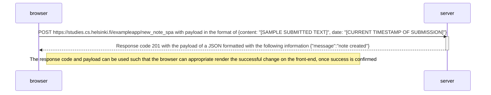

```mermaid
sequenceDiagram
    participant browser
    participant server

    browser->>server: POST https://studies.cs.helsinki.fi/exampleapp/new_note_spa with payload in the format of {content: "[SAMPLE SUBMITTED TEXT]", date: "[CURRENT TIMESTAMP OF SUBMISSION]"}
    activate server
    server-->>browser: Response code 201 with the payload of a JSON formatted with the following information {"message":"note created"}
    deactivate server

    Note right of browser: The response code and payload can be used such that the browser can appropriate render the successful change on the front-end, once success is confirmed
```
